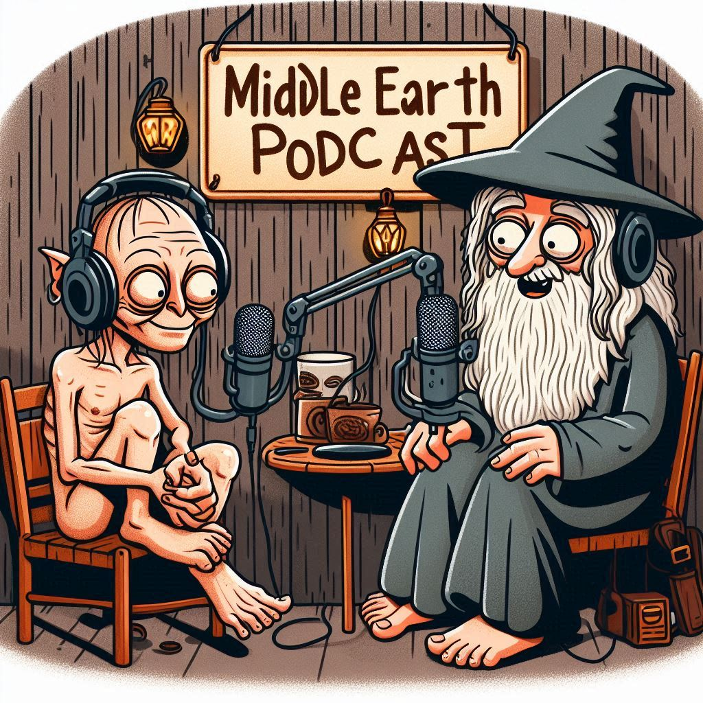

# Podcast Conselho do Codigo

# Projeto Podcast Gerado por I.A.s

 > ℹ️ **NOTE:** Este é o repositório  foi desenvolvido para o Bootcamp Santander AI em parceria com a [DIO](https://dio.me)

Projeto com o objetivo de gerar um podcast utilizando ferramentas de IA através de prompts mais trabalhado.

Utilizer uma esteira de prompts para gerar cada etapa do processo criativo.

## 💻 Tecnologias utilizadas no projeto

- [ARIA-AI](https://www.opera.com/pt-br/features/aria?utm_campaign=%2312%20-%20BR%20-%20Performance%20Max%20-%20PT%20-%20AI%20-%20MKT&utm_content=6480751811&gad_source=1&gclid=CjwKCAjwydSzBhBOEiwAj0XN4CPOhElK5hDsdt567snRqzLoLDy1uYnDrySVFJvvOXRTwlPmKyXbtRoCyfIQAvD_BwE) 
- [Copilot](https://copilot.microsoft.com/)
- [ElevenLabs](https://beta.elevenlabs.io/)
- [Capcut](https://www.capcut.com/pt-br/)

## ✨ Como foi feito ?

- Roteiro gerado via Aria AI
- Audios gerados pela ferramenta de Voice Generator ElevenLabs
- COpilot - DaLL-E-3 Para gerar capas
- Capcut para tratar aúdio e adicionar sons de fundo

## 📚 Materiais

- [Editor de aúdio](https://www.capcut.com/editor?from_page=landing_page&__action_from=picture_V%C3%ADdeos%20profissionais%20em%20minutos,%20n%C3%A3o%20em%20horas.)

## 🛠️ Info e Dicas para criar seus próprio projeto 

- 🤖 1. Use os prompts de roteiro no `Aria AI` 
- 🤖 2. Use os prompts de roteiro gerados pelo chatgpt no  `ElevenLabs`
- 🤖 3. Use os prompts de artes no `Copilot`

## 👨‍💻 Expert

    
    
&nbsp&nbsp&nbspTiago Peniche 
    &nbsp&nbsp&nbsp
    <a 
        href="https://github.com/Penichezito">
        GitHub
    </a>
    &nbsp;|&nbsp;
    <a 
        href="https://www.linkedin.com/in/tiago-peniche-eng-de-software/">
        LinkedIn
    </a>
    &nbsp;|&nbsp;
    <a 
        href="https://www.instagram.com/penichetiago">
        Instagram
    </a>
    &nbsp;|&nbsp;

  

---

⌨️ com 💜 por [Tiago Peniche](https://github.com/Penichezito) 
